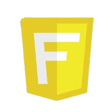

# CURSO DE FASTHTML
👨‍⚖️FASTHTML É UM FRAMEWORK MODERNO BASEADO EM PYTHON PARA CRIAR APLICAÇÕES WEB DINÂMICAS E INTERATIVAS.

  

## CONCEITO:
FastHTML é um framework moderno baseado em Python para criar aplicações web dinâmicas e interativas. Ele combina a simplicidade do HTML com ferramentas avançadas como HTMX e integrações com CSS frameworks leves como o Pico CSS. Seu foco está em tornar o desenvolvimento mais eficiente, permitindo a criação de componentes reutilizáveis e simplificando a manipulação de dados no navegador.

## SUA HISTÓRIA:
FastHTML foi desenvolvido como uma alternativa simples e eficiente para criar aplicações web com Python. Inspirado por frameworks populares como Flask e Django, ele se diferencia ao integrar diretamente ferramentas modernas como HTMX e tecnologias baseadas no protocolo ASGI, como Uvicorn e Starlette. Seu objetivo é facilitar o desenvolvimento de aplicações interativas e responsivas, reduzindo a necessidade de bibliotecas front-end como React ou Angular. A filosofia por trás do FastHTML é "fazer mais com menos", utilizando recursos nativos do HTML e HTTP para oferecer um desempenho robusto e eficiente.  

## CARACTERISTICAS:
### POSITIVAS:
1. **Componentes Reutilizáveis**: Você pode criar elementos reutilizáveis como botões ou formulários, de maneira semelhante a frameworks como React, mas com a simplicidade do Python.
   
2. **Interatividade Avançada com HTMX**: HTMX permite interações dinâmicas, como validações em tempo real e atualizações de página parciais, sem recarregar completamente a página.

3. **Integração com CSS Frameworks**: Com suporte a frameworks como Pico CSS, é fácil criar interfaces modernas e limpas sem necessidade de estilos personalizados extensos.

4. **Desenvolvimento Ágil**: O recarregamento automático permite que mudanças no código sejam refletidas imediatamente no navegador durante o desenvolvimento.

5. **Backend Simplificado**: Baseado em tecnologias como Uvicorn e Starlette, o FastHTML combina eficiência e flexibilidade para lidar com múltiplos métodos HTTP e manipulação de rotas.

### NEGATIVAS: 
- **Menor Comunidade**: Ainda não tem a mesma base de usuários e recursos como frameworks mais maduros, o que pode dificultar o acesso a tutoriais e suporte.  
- **Funcionalidades Limitadas**: Focado em simplicidade, pode não atender projetos que exigem funcionalidades mais avançadas de frameworks como Django.  
- **Dependência do Ecossistema Python**: Como é fortemente atrelado a Python, pode não ser ideal para equipes com foco em outras linguagens ou stacks full-stack independentes.  

## SUBSIDIOS:
- [CURSO CRIADO PELO VILHALVA](https://github.com/VILHALVA)
- [VEJA A DOCUMENTAÇÃO](https://fastht.ml/)
- [LINGUAGEM DE MARCAÇÃO](https://github.com/VILHALVA/CURSO-DE-HTML-E-CSS)
- [LINGUAGEM DE PROGRAMAÇÃO](https://github.com/VILHALVA/CURSO-DE-PYTHON)
- [VEJA O MANUAL](./MANUAL.md)
- [VEJA OS PROJETOS](https://github.com/VILHALVA?tab=repositories&q=topic:FASTHTML)

